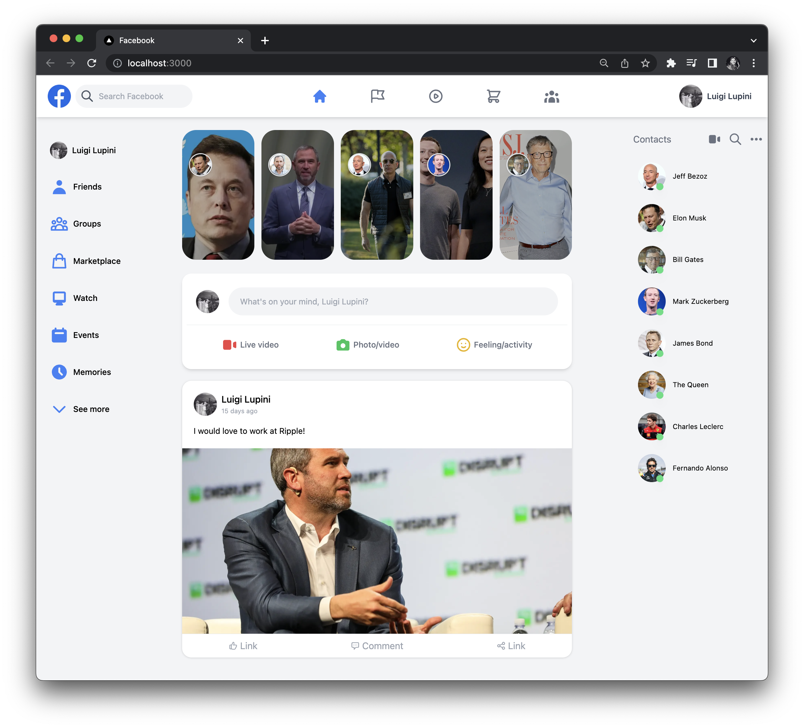

## Facebook clone (with firebase)

> A posting 📭 webapp demonstrating the interaction with firebase and Next.js.



Featuring:

- This is a [Next.js](https://nextjs.org/) project bootstrapped with [`create-next-app`](https://github.com/vercel/next.js/tree/canary/packages/create-next-app).
- All authentication is securely stored with **Facebook Login** services.
- Added **tailwindcss** support by following the [Install Tailwind CSS with Next.js](https://tailwindcss.com/docs/guides/nextjs) guide.
- Added [firebase](https://www.npmjs.com/package/firebase) support and functions to store and query user/post data.
- Register the firebase project as a Web-App to get your **Firebase SDK** to make use of functions.
- [NextAuth](https://next-auth.js.org/getting-started/introduction) is used for a complete authentication solution for this applications.

Dependencies:

```json
"dependencies": {
  "@heroicons/react": "v1",
  "eslint-config-next": "13.0.3",
  "firebase": "^8.5.0",
  "moment": "^2.29.4",
  "next": "13.0.3",
  "next-auth": "3",
  "react": "18.2.0",
  "react-dom": "18.2.0",
  "react-firebase-hooks": "^3.0.4",
  "tailwind-scrollbar-hide": "^1.1.7"
},
```

Regards, <br />
Luigi Lupini <br />
<br />
I ❤️ all things (🇮🇹 / 🛵 / ☕️ / 👨‍👩‍👧)<br />

This is a [Next.js](https://nextjs.org/) project bootstrapped with [`create-next-app`](https://github.com/vercel/next.js/tree/canary/packages/create-next-app).

## Getting Started

First, run the development server:

```bash
npm run dev
# or
yarn dev
```

Open [http://localhost:3000](http://localhost:3000) with your browser to see the result.

You can start editing the page by modifying `pages/index.js`. The page auto-updates as you edit the file.

[API routes](https://nextjs.org/docs/api-routes/introduction) can be accessed on [http://localhost:3000/api/hello](http://localhost:3000/api/hello). This endpoint can be edited in `pages/api/hello.js`.

The `pages/api` directory is mapped to `/api/*`. Files in this directory are treated as [API routes](https://nextjs.org/docs/api-routes/introduction) instead of React pages.
